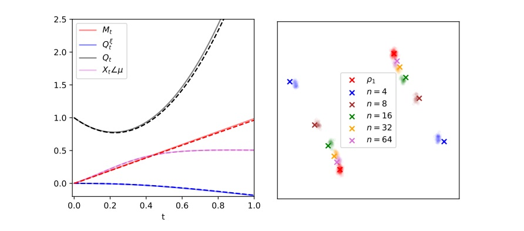

# Diffusion_GMM
Code for the paper : <i>Analysis of learning a flow-based generative model from limited sample complexity
</i> (<a href="https://arxiv.org/abs/2310.03575">link to paper</a>)


<simulation.py> provides a python script that implements the generative model.

<theory.ipynb> solves the theoretical flows for the summary statistics tracking the generative flow.


<p align="center"></center></p>

## Theoretical characterization
(Figs. 1, 2)
- <tt>Theory.ipynb</tt> provides a Jupyter notebook implementation of the theoretical characterization of Result III.1 for the summary statistics tracking the generative flow. Any choice of schedule functions $\alpha(t), \beta(t)$  can be specified as an input.

## Simulations
(Fig. 2)
- <tt>Simulations.py</tt> implements the associated numerical experiments for the flow-based model. The DAE is trained using <tt>Pytorch</tt>. For instance, to run the training on $n=10$ samples from a target binary Gaussian mixture with centroid norm $\lVert \mu\lVert=1.5$ and cluster variance $\sigma=0.5$, run
```
python3 Simulations.py --n 10 --m 1.5 --s 0.5
```

<b> Versions:</b> These notebooks employ <tt>Python 3.12 </tt>.
